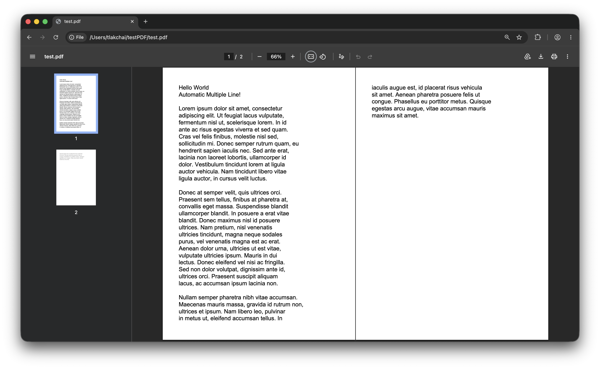

# MheePDF - หมี PDF

🚧 Construction

# Usage
```bash
bun install mheepdf
```

```typescript
import { MheePDF } from "mheepdf";

const pdf = new MheePDF({
  pageSize: MheePDF.A4,
  defaultFontSize: 18,
  margin: 50,
});

pdf.addText("Hello World");
pdf.addText("Automatic Multiple Line!");
pdf.addText("\n");
pdf.addText(`Lorem ipsum ...`);

await Bun.write("test.pdf", pdf.generatePDFcontent());
```
