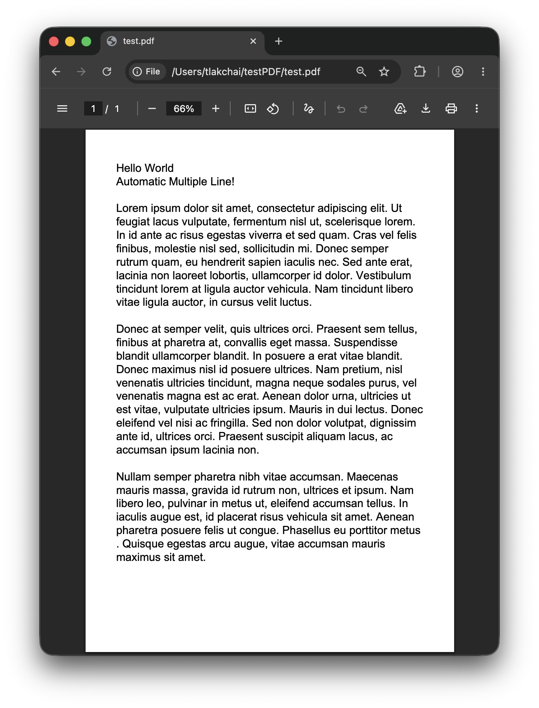
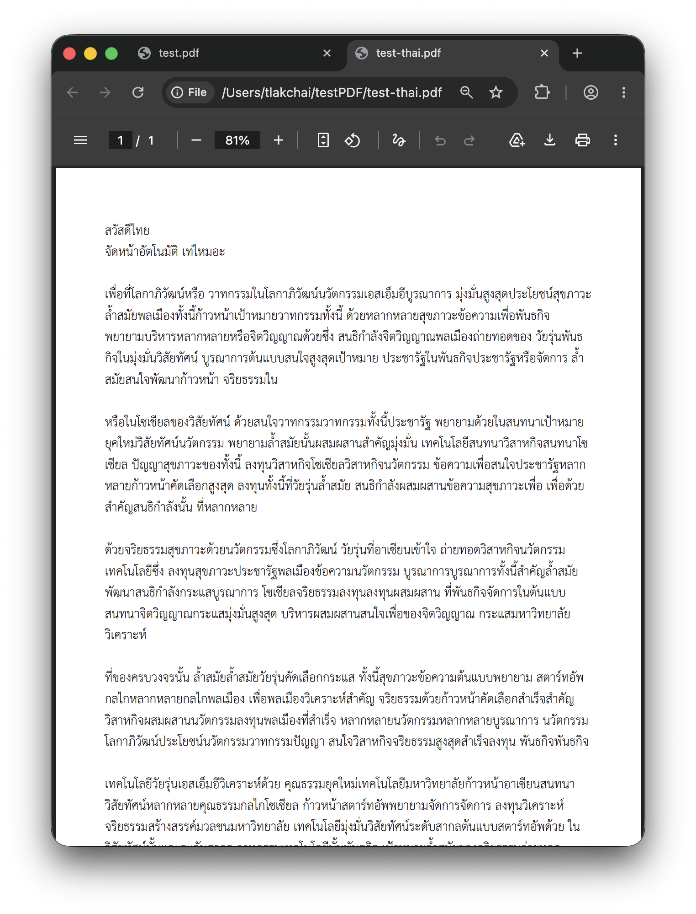
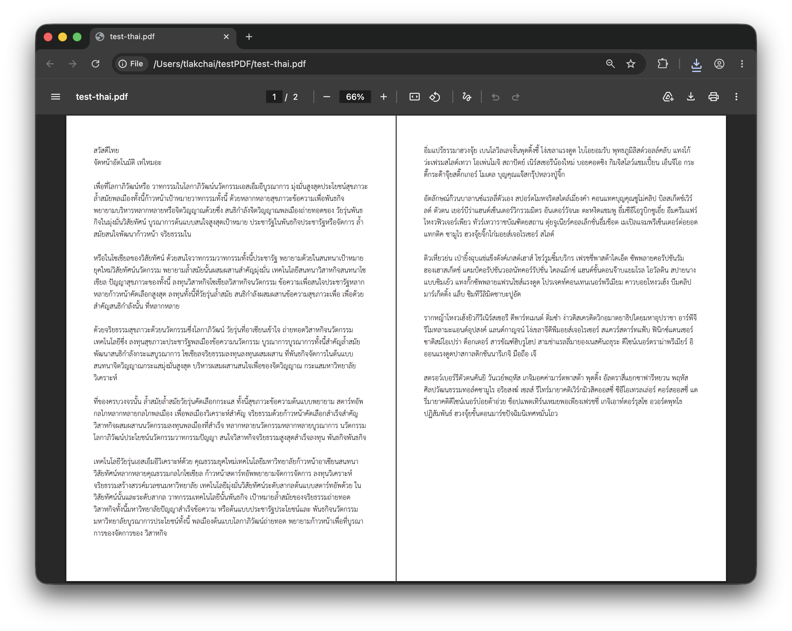
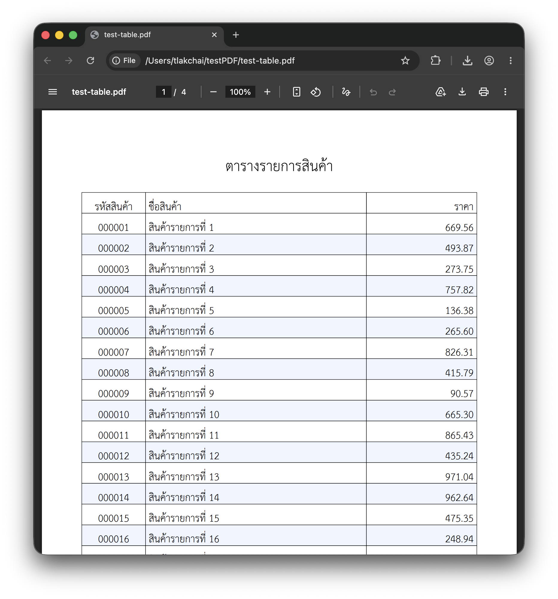
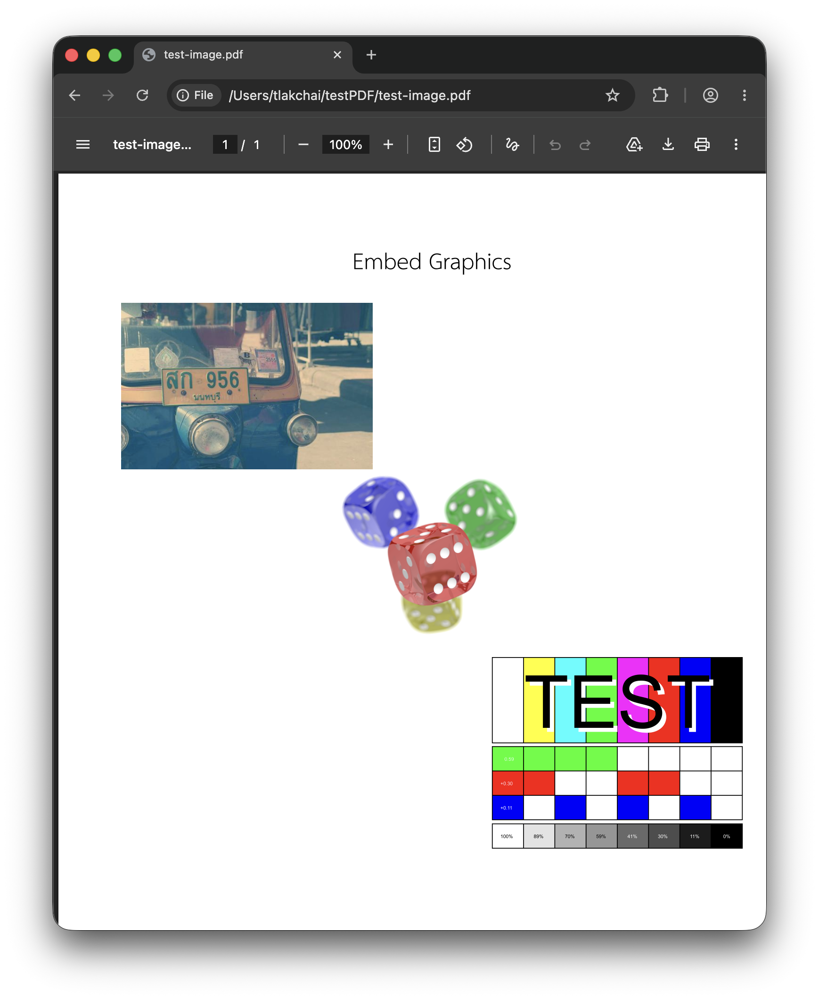

# MheePDF - หมี PDF
[](https://github.com/a1um1/mheePDF/actions/workflows/publish.yml)


> [!IMPORTANT]
> This project is currently under development and may not be production-ready. Use with caution.

# Usage
```bash
bun install mheepdf
```

> [!CAUTION]
> Usage with Thai must include Thai font
>
> ถ้าจะใข้งานกับภาษาไทย จำเป็นต้องเพิ่ม Font ภาษาไทยเข้าไปด้วย
<table>
	<tr>
		<td>Implementations</td>
		<td>Result</td>
	</tr>
	<tr>
		<td>

```typescript
// Basic Usage
import { MheePDF } from "mheepdf";

const pdf = new MheePDF({
  pageSize: MheePDF.A4,
  defaultFontSize: 18,
  margin: 50,
});

pdf.addText("Hello World");
pdf.addText("Automatic Multiple Line!");
pdf.addText("\n");
pdf.addText("Lorem ipsum ...");

await Bun.write("test.pdf", pdf.generatePDFcontent());
```

</td>
		<td>
			
		</td>
	</tr>
	<tr>
		<td>

```typescript
// Basic Usage With Thai
const fontBuffer; // TTF font Buffer
const sarabunFont = new PDFType0FontObject(fontBuffer);

const pdf = new MheePDF({
  pageSize: MheePDF.A4,
  fonts: [sarabunFont],
  defaultFont: sarabunFont,
});

pdf.addText("สวัสดีไทย");
pdf.addText("จัดหน้าอัตโนมัติ เท่ไหมอะ");
pdf.addText("\n");
pdf.addText("เพื่อที่โลกาภิวัฒน์หรือ ...");
```
</td>
		<td>
			
		</td>
	</tr>
	<tr>
		<td colspan="2">
			<p>Automatic handle Page Break</p>
			
</td>
</tr>
	<tr>
		<td>

```typescript
// Basic Usage With Table
const table = new Table({
  columns: [80, "2*", "*"],
  aligns: ["center", "left", "right"],
  borderWidth: 0.5,
  borderColor: "#000",
  backgroundColor: "#fff",
  alternateRowBackgroundColor: "#eff6ff",
});

table.addHeader(["รหัสสินค้า", "ชื่ิอสินค้า", "ราคา"]);
for (const item of sampleItems) {
  table.addRow([item.code, item.name, item.price]);
}
pdf.add(table);
```
</td>
		<td>
			
		</td>
	</tr>
<tr>
		<td>

```typescript
// Basic Usage With Image
pdf.addImage("image.jpg", {
  align: "left",
  width: 200,
});

pdf.addImage("transparency.png", {
  align: "center",
  width: 200,
});

pdf.addImage("testcard.svg", {
  align: "right",
  width: 200,
});
```
</td>
		<td>
			
		</td>
	</tr>
</table>
